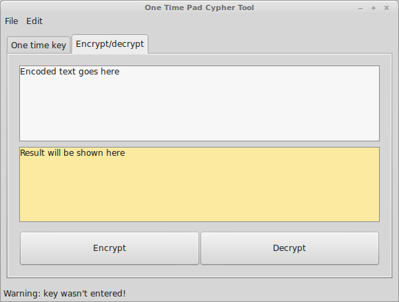
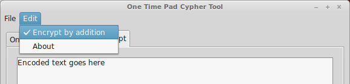

# 
Simple OTP encrypter/decrypter
==============================

Made for educational purpose. Simple One-Time Pad encryption tool. If  you want one, you'd build it using Lazarus.

It can encrypt or decrypt digitally coded message using one time pad. You have to code your message before encryption (or after decryption) yourself (using good old [straddling checkerboard,](https://en.wikipedia.org/wiki/VIC_cipher#Straddling_checkerboard) for example). 

How it works
-----------

1. Enter your one-time key at corresponding tab
1. Enter your encoded text in "Encrypt/decrypt" tab
1. Change encryption/decryption algorythm in "Edit" menu, if desired
1. Click "Encrypt" to encrypt source text with entered key, or "Decrypt" to decrypt

Encryption algorythms
---------------------

There are two possibilities: **encrypt message using modular addition,** and then decrypt using modular substraction, or **encrypt using substraction,** and decrypt using addition. The first one is default for this program (checked in Edit menu). 

More in-depth info on one-time pad encryption here: http://users.telenet.be/d.rijmenants/en/onetimepad.htm

